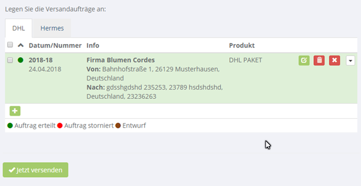
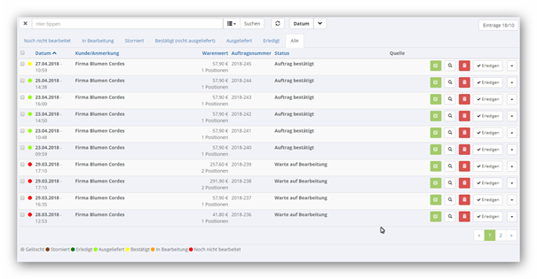
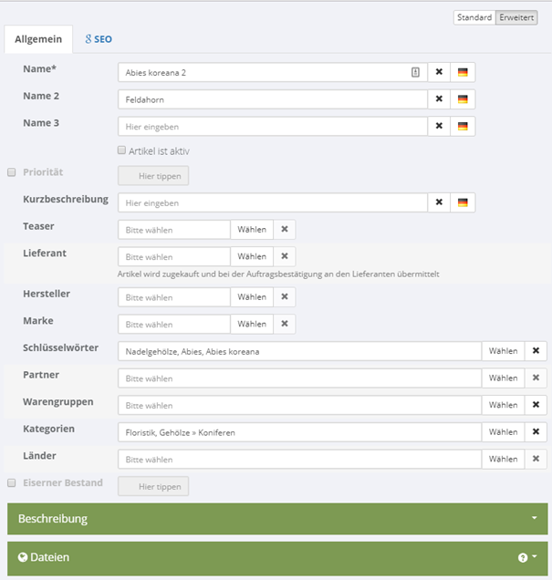
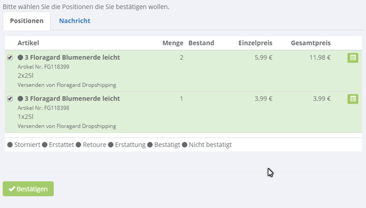
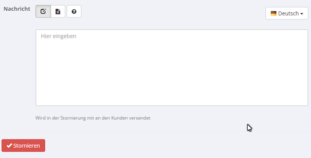
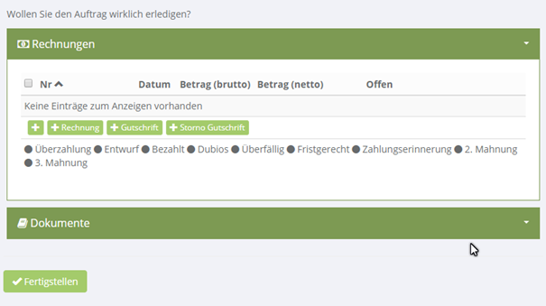

# Omni Channel System (OCS)
## REST API


## Inhaltsverzeichnis

**[Übersicht](#übersicht)**

**[Hinweise](#hinweise)**

**[Funktionsweise](#funktionsweise)**

**[Fehlerbehandlung](#fehlerbehandlung)**

**[Voraussetzungen](#voraussetzungen)**

**[Server](#Server)**

**[Abfragen](#abfragen)**

**[Postman](#postman)**

**[Authorisierung](#authorisierung)**

**[Währungen](#währungen)**

**[Länder](#länder)**

**[Kategorien](#kategorien)**

**[Berichte](#berichte)**

> [Kundenkarten](#kundenkarten)

> [Neue Kundenkarten abfragen](#neue-kundenkarten-abfragen)

> [Neue Kundenkarten validieren](#neue-kundenkarten-validieren)

> [Aktueller Umsatz](#aktueller-umsatz)

**[Webshop Bestellungen](#webshop-bestellungen)**

**[Auftragsdaten](#auftragsdaten)**

**[Videos](#videos)**

**[Filialen](#filialen)**

**[Kunden](#kunden)**

**[Artikel](#artikel)**

> [Erweiterte Anlage](#erweiterte-anlage)

> [Transaktionen](#transaktionen)

> [Varianten](#Varianten)

> [Dialog Bearbeiten](#dialog-bearbeiten)

**[Bestellungen](#bestellungen)**

> [Alle Shop Bestellungen](#alle-shop-bestellungen)

> [Status anpassen](#status-anpassen)

> [Dialog Versenden](#dialog-versenden)

> [Dialog Bestätigen](#dialog-bestätigen)

> [Dialog Erledigen](#dialog-erledigen)

> [Dialog Stornieren](#dialog-stornieren)

> [Dialog Auftragsverwaltung](#dialog-auftragsverwaltung)

**[Dokumente](#dokumente)**

> [Lieferschein Bestellung](#lieferschein-bestellung)

> [Lieferschein Teilbestellung](#lieferschein-teilbestellung)

**[Versandaufträge](#versandaufträge)**

> [Packetaufkleber abfragen](#packetaufkleber-abfragen)

**[Dateien](#dateien)**

> [Dateien Hochladen](#dateien-hochladen)

> [Bilder hochladen](#bilder-hochladen)

**[Gutscheine](#gutscheine)**

> [Gutschein erstellen](#gutschein-erstellen)

> [Gutschein finden](#gutschein-finden)

> [Zahlung reservieren](#zahlung-reservieren)

> [Zahlung durchführen](#zahlung-durchführen)

**[Nachrichten](#nachrichten)**

> [Nachricht erstellen](#nachricht-erstellen)

**[Aufträge](#aufträge)**

**[Container](#container)**

**[Jahresplanungen](#jahresplanungen)**

**[Piktogramme](#piktogramme)**

**[Suche](#suche)**

**[Verknüpfte Inhalte für Artikel](#verknüpfte-inhalte-für-artikel)**

**[Verknüpfte Inhalte für Bericht](#verknüpfte-inhalte-für-bericht)**

**[Verknüpfte Inhalte für Video](#verknüpfte-inhalte-für-video)**

**[Extern hinzufügen](#extern-hinzufügen)**

> [Suchen](#Suchen)

> [Nach einem Artikel suchen](#nach-einem-artikel-suchen)

> [Pflanzen importieren](#pflanzen-importieren)

> [Videos importieren](#videos-importieren)

> [Berichte importieren](#berichte-importieren)

> [Bilder importieren](#bilder-importieren)

> [Pflanzenfotos importieren](#pflanzenfotos-importieren)

**[Zwischenspeicher](#zwischenspeicher)**

> [Alle caches löschen](#alle-caches-löschen)

> [Datenbank- Cache löschen](#datenbank-cache-löschen)

> [Caches aufräumen](#caches-aufräumen)

**[Datenstrukturen](#datenstrukturen)**

> [Order](#order)

> [ShipmentOrder](#shipmentorder)

> [Article](#article)

> [Job](#job)

> [Payment](#payment)

> [Voucher](#voucher)

> [VoucherCode](#vouchercode)

> [FoundVoucher](#foundvoucher)

> [OrderStatusType](#orderstatustype)

> [TransactionStatus](#transactionstatus)

> [MessageType](#messagetype)

> [MessageDirection](#messagedirection)

> [Documentation](#documentation)

> [Artikelstatus](#artikelstatus)

> [File](#file)

> [Transaktion](#transaktion)

> [OrderStatus](#orderstatus)

> [DebitCard](#debitcard)

> [Result](#result)

> [Dialog](#dialog)

> [Upload](#upload)

> [Message](#message)

**[Dialoge](#dialoge)**

> [Versenden](##versenden)

> [Auftragsverwaltung](#auftragsverwaltung)

> [Artikel bearbeiten](#artikel-bearbeiten)

> [Bestellung bestätigen](#bestellung-bestätigen)

> [Bestellung stornieren](#bestellung-stornieren)

> [Bestellung erledigen](#bestellung-erledigen)

**[Beispiele + API](#beispiel-applikation)**

> [Beispiel Applikation](#beispiel-applikation)

> [Token abfragen zur Authentifizierung](#token-abfragen-zur-authentifizierung)

> [Artikel anlegen](#artikel-anlegen)

> [Bestellungen abfragen](#bestellungen-abfragen)

# Übersicht

Mit dem Webservice können kann das System ausgelesen werden

# Hinweise

Eine Sitzung ist unbegrenzt gültig.

# Funktionsweise

Die API-Aufrufe werden als REST-Request durchgeführt, authentifiziert mit einem Zugriffstoken.

# Fehlerbehandlung

Im Fehlerfall eines Aufrufes wird ein Json Objekt mit den Fehlerinformationen zurückgegeben

# Voraussetzungen

Man benötigt ein Benutzerkonto auf dem CMS System mit ausreichender Berechtigung.

# Server

Die Anfragen werden über die folgende URL aufgerufen:

http://{domain}/api/

# Abfragen

Es gibt 6 Arten von Anfragen die für alle Entitäten gleich sind:

| **URL** | **Methode** | **Beschreibung** |
| --- | --- | --- |
| api/{entities} | GET | Liste von Entitäten abfragen |
| api/{entities}/{id} | GET | Entität abfragen |
| api/{entities}/?ext={external\_key} | GET | Entität auf Basis des External\_key abfragen |
| api/{entities}/{id} | PUT | Entität updaten |
| api/{entities} | PUT | Mehrere Entitäten updaten/anlegen wenn ein Array übertragen wird |
| api/{entities}/{id} | DELETE | Entität löschen |
| api/{entities} | POST | Eine neue Entität anlegen |

Alle Funktionen erwarten 3 Hostheader:

| **Header** | **Beschreibung** |
| --- | --- |
| **token** | Authorisierung |
| **language** | Sprache (z.B. de-DE) |
| **version** | 1.0 (default) |
| **vendor** | Beliebiger Name |

Alle Funktionen die Listen zurückgeben haben folgende Parameter:

| **Parameter** | **Beschreibung** |
| --- | --- |
| **pageIndex** | Aktuelle Seite |
| **pageSize** | Anzahl Einträge pro Seite |
| **Search** | Suchstring |
| **orderBy** | Sortierung (string) |
| **filter** | Filterkriterien |

> **Nur ausgewählte Felder abfragen/aktualisieren**

Bei dem GET und PUT zu einer Entität (Abfragen/Updaten) kann noch ein Parameter „properties&quot; mitgegeben werden um zu definieren welche Felder aus dem Model überhaupt verwendet/gefüllt werden sollen. Für z.B. Artikel sähe sowas wie folgt aus:

api/articles/4687?properties=Name,Name2,Photos,Keys,Keys.Info,Keys.Value,Keys.EAN,Keys.Photos

# Postman

Ein gutes Tool um die Schnittstelle zu testen vor der Implementation finden Sie hier:

[https://www.getpostman.com/](https://www.getpostman.com/)

Damit können Sie alles Abfragen ausprobieren ohne die Schnittstelle implementiert zu haben.

# Authorisierung

Die Authorisierung muss nur 1-mal durchgeführt werden vom Entwickler. Der daraus entstehende Token kann dann dauerhaft für den Zugriff verwendet werden ohne dass das Benutzername/Passwort erneut übertragen werden muss:

| **Funktion** | **Paramete** | **Beschreibung** |
| --- | --- | --- |
| api/account/validate |user| Benutzername ||
|password| Passwort |

Als Rückgabe wird ein Token zurückgegeben der bei allen folgenden Abfragen mitgegeben werden muss.

# Währungen

| Url | api/currencies |
| --- | --- |

# Länder

| Url | api/countries |
| --- | --- |

# Kategorien

| Url | api/categories |
| --- | --- |

# Berichte

| Url | api/reports |
| --- | --- |

#


# Kundenkarten

| Url | api/debitcards |
| --- | --- |

## Neue Kundenkarten abfragen

Listet neue Kundenkarten ohne Validierung an den Anfang der Liste. Sie können dann pageweise immer weitergehen bis ein Datensatz erscheint der bereits validiert wurde.

**Siehe [DebitCard](#debitcard)**

**Funktion: GET** /api/debitcards?orderby=ValidatedOn

| **Parameter** | **Typ** | **Beschreibung** | **Bemerkung** |
| --- | --- | --- | --- |
| **orderby** |string| Sortierung | Listet die noch nicht zugeordneten Kundenkarten nach oben |

## Neue Kundenkarten validieren

Neue Kundenkarten müssen von der WaWi einmalig validiert werden das diese auch von dem eingeloggten Benutzer verwendet werden dürfen. Hierzu laden Sie sich bitte den Kunden, der der Karte zugeordnet ist und vergleichen z.B. Adressdaten

**Funktion: POST** /api/debitcards/validate/{id}

| **Parameter** | **Typ** | **Beschreibung** |
| --- | --- | --- |
| **id** |long| ID der Kundenkarte |
| **valid** |Bool| Gültig oder nicht |
| **Error** |string| Falls nicht gültig kann hier der Grund angegeben werden. Dieser Text wird dann dem Kunden angezeigt, wenn er versucht mit der Karte zu kaufen. Ansonsten bitte leer mitgeben |
| **Turnover** |Double| Aktueller Umsatz auf der Kundenkarte |

## Aktueller Umsatz

In festen Intervallen müssen der aktuelle Umsatz sowie die einzelnen Auftragsdaten übertragen werden.

Setzen Sie hierfür das Turnover Feld auf den aktuell gebuchten Umsatz.

## Webshop Bestellungen

Webshop Aufträge haben nun eine Verknüpfung „DebitCard&quot; zu der Kundenkarte, der sie zugeordnet werden sollen.

## Auftragsdaten

Die Aufträge können als api/orders mit dem Status „Ready&quot; im System angelegt und dann über das DebitCard Feld mit der Kundenkarte verknüpft werden. Bitte verwenden Sie bei der Transaction den Type Cashdesc (4) damit das System weiß, das der Auftrag über die Kasse gelaufen ist.

> Bitte achten Sie darauf uns nur Bestellungen zu übermitteln die Sie nicht von uns bekommen haben!

# Videos

| Url | api/videos |
| --- | --- |

# Filialen

| Url | api/chainstores |
| --- | --- |

# Kunden

| Url | api/members |
| --- | --- |

# Artikel

| Url | api/articles |
| --- | --- |

## Erweiterte Anlage

Mit dieser Funktion kann ein Artikel angelegt und direkt mit einem Green – Solutions Artikel um Informationen angereichert werden

**Funktion: POST** api/articles/create

| **Parameter** | **Typ** | **Beschreibung** | **Bemerkung** |
| --- | --- | --- | --- |
| **importExternal** |bool| Externe Daten hinzufügen? ||
| **compareNameSecondary** |bool| Name 2 vergleichen? ||

## Transaktionen

Mit dieser Funktion können bei größeren Mengen von Artikeln die Bestände und die Preise aktualisiert werden

**Funktion: POST** api/articles/ transaction

| **Parameter** | **Typ** | **Beschreibung** | **Bemerkung** |
| --- | --- | --- | --- |
| **BODY** |ArticleTransactionArgs[]| Ein Array mit mehreren Transaktionen | Siehe **[Transaktionen](#transaktionen)** |

## Varianten

| Url | api/articlekeys |
| --- | --- |

## Dialog Bearbeiten

| **Funktion(POST)** | **Parameter** | **Typ** | **Beschreibung** |
| --- | --- | --- | --- |
| api/articles/dialog/{id} |ID| **long** | ID des Artikels der bearbeitet werden soll |

Als Rückgabe wird der Dialog zurückgegeben (siehe **[Dialog](#dialog)** und **[Artikel bearbeiten](#artikel-bearbeiten)** )

# Bestellungen

| **Url** | **api/orders** |
| --- | --- |
| Filter | ownermemberid |

## Alle Shop Bestellungen


> Diese Funktion ist nur zulässig von Benutzern innerhalb des Hauptaccount des Shops! Andernfalls wird ein entsprechender Fehler ausgelöst.


| Url | api/orders/all |
| --- | --- |


## Status anpassen

| **Funktion(POST)** | **Parameter** | **Typ** | **Beschreibung** |
| --- | --- | --- | --- |
| api/orders/transactions/status/{ID} |ID| **long** | ID der Bestellung ||
|BODY| **Statusmeldung** | Siehe **[OrderStatus](#orderstatus)** |

Als Rückgabe wird die Bestellung zurückgegeben (siehe **[Order](#order)** )

## Dialog „Versenden&quot;

| **Funktion(POST)** | **Parameter** | **Typ** | **Beschreibung** |
| --- | --- | --- | --- |
| api/orders/transactions/dialog/delivered/{id} |ID| **long** | ID der Transaction der Bestellung (muss versenden sein) |

Als Rückgabe wird der Dialog zurückgegeben (siehe **[Dialog](#dialog)** und **[Versenden](##versenden)** )

## Dialog „Bestätigen&quot;

| **Funktion(POST)** | **Parameter** | **Typ** | **Beschreibung** |
| --- | --- | --- | --- |
| api/orders/dialog/confirm/{id} |ID| **long** | ID der Bestellung |

Als Rückgabe wird der Dialog zurückgegeben (siehe **[Dialog](#dialog)** und **[Bestellung bestätigen](#bestellung-bestätigen)**)

## Dialog „Erledigen&quot;

| **Funktion(POST)** | **Parameter** | **Typ** | **Beschreibung** |
| --- | --- | --- | --- |
| api/orders/dialog/finish/{id} |ID| **long** | ID der Bestellung |

Als Rückgabe wird der Dialog zurückgegeben (siehe [Dialog](#dialog) und **[Bestellung erledigen](#bestellung-erledigen)** )

## Dialog „Stornieren&quot;

| **Funktion(POST)** | **Parameter** | **Typ** | **Beschreibung** |
| --- | --- | --- | --- |
| api/orders/dialog/cancel/{id} |ID| **long** | ID der Bestellung |

Als Rückgabe wird der Dialog zurückgegeben (siehe [Dialog](#dialog) und **[Bestellung stornieren](#bestellung-stornieren)** )

## Dialog „Auftragsverwaltung&quot;

| **Funktion(POST)** | **Parameter** | **Typ** | **Beschreibung** |
| --- | --- | --- | --- |
| api/orders/dialog ||||

Als Rückgabe wird der Dialog zurückgegeben (siehe [Dialog](#dialog) und **[Auftragsverwaltung](#auftragsverwaltung)** )

# Dokumente

## Lieferschein Bestellung

Liefert den Lieferschein zu einer Bestellung.

Bitte beachten Sie das sie nur die Positionen bekommen die bestätigt sind daher darf diese Funktion nur nach erfolgter Auftragsbestätigung aufgerufen werden.

| **Funktion(GET)** | **Parameter** | **Typ** | **Beschreibung** |
| --- | --- | --- | --- |
| api/documents/order/{orderid}/{type} |orderid| **long** | ID der Bestellung |
||type| **string** | DeliverySlip |
|| output || DOCX, PDF |

## Lieferschein Teilbestellung

Liefert den Lieferschein zu einer Teilbestellung.

Bitte beachten Sie das sie nur die Positionen bekommen die bestätigt sind daher darf diese Funktion nur nach erfolgter Auftragsbestätigung aufgerufen werden.

| **Funktion(GET)** | **Parameter** | **Typ** | **Beschreibung** |
| --- | --- | --- | --- |
| api/documents/order/{orderid}/{type}/{transactionid} |orderid| **long** | ID der Bestellung ||
|type| **string** | DeliverySlip ||
|Transactionid| **long** | ID der Teilbestellung ||
|Output|**string**| DOCX, PDF |

# Versandaufträge

Enthält eine Liste aller Versandaufträge im System. Jeder Versandauftrag kann mehrere Items enthalten (Sendungen)

| Url | api/shipmentorders |
| --- | --- |

Siehe **[ShipmentOrder](#shipmentorder)**

## Packetaufkleber abfragen

Mit dieser Funktion kann der Paketschein abgefragt werden. Übergeben Sie dafür eine der ShipmentOrderID des Versandauftrags (siehe **[ShipmentOrder](#shipmentorder)** )

| **Funktion(POST)** | **Parameter** | **Typ** | **Beschreibung** |
| --- | --- | --- | --- |
| api/shipmentorders/items/label/{id} |ID| **long** | ID der Sendung |

Als Rückgabe wird die Pdf zurückgegeben

# Dateien

| Url | api/datafiles |
| --- | --- |

## Dateien Hochladen

| **Funktion(POST)** | **Parameter** | **Typ** | **Beschreibung** |
| --- | --- | --- | --- |
| api/datafiles/upload |BODY| **Upload** | Siehe **[Upload](#upload)** |

Als Rückgabe wird die Datei zurückgegeben (siehe **[File](#file)** )

## Bilder hochladen

| **Funktion(POST)** | **Parameter** | **Typ** | **Beschreibung** |
| --- | --- | --- | --- |
| api/pictures/upload |BODY| **Upload** | Siehe **[Upload](#upload)** |

Als Rückgabe wird die Datei zurückgegeben (siehe **[File](#file)** )

# Gutscheine

| Url | api/vouchers ||
| --- | --- | --- |

## Gutschein erstellen

| **Funktion(POST)** | **Parameter** | **Typ** | **Beschreibung** |
| --- | --- | --- | --- |
| api/vouchers/create |name| **string** | Name für den neuen Gutschein ||
|amount| **double** | Betrag ||
|currencyName| **string** | Währung (z.B. EUR) ||
|info| **string** | Eine Info die beim Gutschein sichtbar hinterlegt wird ||
|deleted| **bool** | Gelöscht anlegen |

Als Rückgabe wird der Gutschein zurückgegeben (siehe **[Voucher](#voucher)** ).

# Nachrichten

Es werden Daten zwischen dem Webshop und dem Lieferanten über Nachrichten ausgetauscht. 
Jede Nachricht kann einen der **[MessageType](#messagetype)** definierten Typen haben. Es können ausgehende oder eingehende Nachrichten erzeugt werden (siehe **[MessageDirection](#messagedirection)**).
Bei einer ausgehenden Nachricht setzen Sie bitte den "Receiver" und bei eingehenden den "Sender".

> Bitte beachten Sie das manche Nachrichten als Antwort auf eine eingehende Nachricht gedacht Sind und daher per "Parent" miteinander verknüpft werden müssen.

| Url | api/messages ||
| --- | --- | --- |

Siehe **[Message](#message)**

## Nachricht erstellen

| **Funktion(POST)** | **Parameter** | **Typ** | **Beschreibung** |
| --- | --- | --- | --- |
| api/messages/create |BODY| **[Message](#message)** | Nachricht die erstellt werden soll ||

Als Rückgabe wird die erstellte Nachricht zurückgegeben (siehe **[Message](#message)** ). Diese wird dann bei dem nächsten Job der die Nachrichten verarbeitet an den Empfänger versendet.

## Gutschein finden

| **Funktion(GET)** | **Parameter** | **Typ** | **Beschreibung** |
| --- | --- | --- | --- |
| api/vouchers/find |keyValue| **string** | Gutscheincode (ohne Leerzeichen) |

Rückgabe: Gutschein –Code (siehe **[FoundVoucher](#foundvoucher)** )

## Zahlung reservieren

Eine Zahlung für einen Gutschein reservieren. Während der Zeit gilt der Umsatz als verbraucht bis die Zeit abläuft und kann nicht an anderer Stelle verbraucht werden.

| **Funktion(POST)** | **Parameter** | **Typ** | **Beschreibung** |
| --- | --- | --- | --- |
| api/vouchers/reserve |voucherID| **long** | Gutschein ID ||
|voucherCodeID| **long** | Gutschein Code ID ||
|amount| **double** | Betrag der reserviert werden soll ||
|currencyName| **string** | Währung (z.B. EUR) ||
|info| **string** | Eine Info die bei der Zahlung sichtbar hinterlegt wird ||
|minutes| **int** | Anzahl der Minuten für die die Zahlung reserviert werden soll |

Als Rückgabe wird die erstellte Zahlung zurückgegeben (siehe **[Payment](#payment)** ).

## Zahlung durchführen

Nachdem eine Zahlung reserviert worden ist kann die Zahlung dann durchgeführt werden (während der Zeit der Reservierung)

| **Funktion(POST)** | **Parameter** | **Typ** | **Beschreibung** |
| --- | --- | --- | --- |
| api/vouchers/pay |paymentid| l **ong** | ID der Zahlung (siehe **[Payment](#payment)** ) |

Als Rückgabe wird der Gutschein zurückgegeben (siehe **[Voucher](#voucher)** ).

# Aufträge

| Url | api/jobs |
| --- | --- |

# Container

| Url | api/containers ||
| --- | --- | --- |
| Schlüssel | api/containers/key/{key} | Container mit Schlüssel suchen |
| Items | Api/containers/items/{id} | Alle Einträge eines Containers (inkl. Paging) |

# Jahresplanungen

| Url | api/timelines ||
| --- | --- | --- |
| Schlüssel | api/timelines/key/{key} | Planung mit Schlüssel suchen |
| Items | api/timelines/items/{id} | Alle Einträge einer Planung (inkl. Paging) |
| Current | api/timelines/current/{id} | Alle aktuellen Einträge einer Planung (inkl. Paging) |

# Piktogramme

**Funktion:** api/pictos/{id}

| **Parameter** | **Typ** | **Beschreibung** | **Bemerkung** |
| --- | --- | --- | --- |
| **id** | long | Artikel ID | Artikel für den das Piktogramm abgefragt werden soll |
| **width** | int | Breite | px |
| **height** | int | Höhe | px |

**Rückgabe:**

Eine Liste aller gültigen Piktogramme für den gewählten Artikel

**Definition:**

| **Feld** | **Typ** | **Beschreibung** |
| --- | --- | --- |
| Name | string | Name des Piktogramms (darzustellen in fett unter/neben dem Piktogramm)z.B. „Standort&quot; |
| Text | string | Text des Piktogramms (darzustellen unter/neben dem Namen)z.B. „Sonnig&quot; |
| Key | string | Eindeutiger Schlüssel |
| Url | string | URL für die Grafik |
| PictoID | long | Primärschlüssel |

# Suche

**Funktion:** api/search

| **Parameter** | **Typ** | **Beschreibung** | **Bemerkung** |
| --- | --- | --- | --- |
| **search** |string| Suchbegriff ||
| **orderBy** |string| Title, Title2 ||
| **Types** |string| Article, Report, Video | Kann auch mehrfach angegeben werden z.B. Types=Article&amp;Types=Video |
| **BloomingTimeFrom** |int| Blütezeit von | Monate |
| **BloomingTimeTo** |int| Blütezeit bis | Monate |
| **WidthFrom** |double| Breite von | cm |
| **WidthTo** |double| Breite bis | cm |
| **HeightTo** |double| Höhe von | cm |
| **HeightFrom** |double| Höhe bis | cm |
| **WeightFrom** |double| Gewicht von | kg |
| **WeightTo** |double| Gewicht bis | kg |
| **GrowthFrom** |double| Zuwachs von | cm |
| **GrowthTo** |double| Zuwachs bis | cm |
| **FeatureIds** |long[]| Merkmale | ID&#39;s der Merkmale (siehe Admin/Features) |

# Verknüpfte Inhalte für Artikel

**Funktion:** api/cross/articles{id}

| **Parameter** | **Typ** | **Beschreibung** | **Bemerkung** |
| --- | --- | --- | --- |
| **id** |long| ID des Artikel ||
| **search** |string| Suchbegriff ||
| **orderBy** |string| Title, Title2 ||
| **Types** |string| Article, Report, Video | Kann auch mehrfach angegeben werden z.B. Types=Article&amp;Types=Video |

# Verknüpfte Inhalte für Bericht

**Funktion:** api/cross/reports/{id}

| **Parameter** | **Typ** | **Beschreibung** | **Bemerkung** |
| --- | --- | --- | --- |
| **id** |long| ID des Berichts ||
| **search** |string| Suchbegriff ||
| **orderBy** |string| Title, Title2 ||
| **Types** |string| Article, Report, Video | Kann auch mehrfach angegeben werden z.B. Types=Article&amp;Types=Video |

# Verknüpfte Inhalte für Video

**Funktion:** api/cross/videos/{id}

| **Parameter** | **Typ** | **Beschreibung** | **Bemerkung** |
| --- | --- | --- | --- |
| **id** |long| ID des Video ||
| **search** |string| Suchbegriff ||
| **orderBy** |string| Title, Title2 ||
| **Types** |string| Article, Report, Video | Kann auch mehrfach angegeben werden z.B. Types=Article&amp;Types=Video |

# Extern hinzufügen

Über diese Funktion können Inhalte aus der Green-Solutions Datenbank gesucht und in die lokale CMS Datenbank importiert werden. Siehe „Extern Hinzufügen&quot; im CMS Backend!

## Suchen

**Funktion:** api/external/search

|pageIndex| Aktuelle Seite |
| --- | --- |
|pageSize| Anzahl Einträge pro Seite |
|search| Suchstring |
|orderBy| Sortierung (string) |

**Rückgabe:**

Eine Liste aller externen Suchergebnisse

## Nach einem Artikel suchen

**Funktion:** api/external/search/article

|name| Name des Artikels (z.B. Acer Palmatum Bloodgood) |
| --- | --- |

**Rückgabe:**
Den am besten passenden Artikel

## Pflanzen importieren

**Funktion:** api/external/import/plants/{id}

|id| Externe ID der Pflanze die importiert werden soll |
| --- | --- |
|to|ID des Artikels in den importiert werden soll (optional)|

## Videos importieren

**Funktion:** api/external/import/videos/{id}

|id| Externe ID des Videos das importiert werden soll |
| --- | --- |

## Berichte importieren

**Funktion:** api/external/import/reports/{id}

|id| Externe ID des Berichts der importiert werden soll |
| --- | --- |

## Bilder importieren

**Funktion:** api/external/import/pictures/{id}

|id| Externe ID des Bildes das importiert werden soll |
| --- | --- |

## Pflanzenfotos importieren

**Funktion:** api/external/import/plantpictures/{id}

|id| Externe ID des Pflanzenfotos das importiert werden soll |
| --- | --- |

# Zwischenspeicher (Cache)

Zur Verbesserung der Performance arbeitet das System mit einigen Caches die bei Bedarf gelöscht werden müssen. Momentan gibt es die folgenden Caches:

- Datenbank
- Sessions
- Suchindex
- Sitemaps

Sobald gecachte Inhalte in der Datenbank verändert wurden sollte der korrespondierende Cache gelöscht werden damit die Änderung direkt sichtbar wird.

## Alle caches löschen

**Funktion:** POSTapi/cache/clear

## Datenbank- Cache löschen

**Funktion:** POSTapi/cache/clear/efcache

## Caches aufräumen

**Funktion:** POSTapi/cache/purge

# Datenstrukturen

## Order

```csharp
{
  "OrderID": 174,
  "Voucher": null,
  "VoucherCode": null,
  "InvoiceAddress": {
    "ContactAddressID": 6,
    "Type": 1,
    "Address": {
      "AddressID": 7,
      "Street": "Bahnhofstraße",
      "HouseNumber": "62b",
      "Zip": "26835",
      "City": "Hesel",
      "Postbox": null,
      "Country": {
        "ID": 0,
        "RowVersion": "#0#0#0#0#0#2#58#151"
      },
      "Type": 1,
      "Longitude": null,
      "Latitude": null,
      "External_Key": null,
      "External_COR_ID": null
    },
    "Contact": {
      "ContactID": 23,
      "Picture": null,
      "Apellation": 1,
      "FirstName": "Kevin",
      "LastName": "Klaassen",
      "Phone": "1325513154712",
      "Mobile": null,
      "Fax": null,
      "Position": null,
      "Homepage": null,
      "EMail": "jhaghjs@bjkafgs.de",
      "Company": null,
      "Company2": null,
      "Language": {
        "ID": 0,
        "RowVersion": "#0#0#0#0#0#2#44#148"
      },
      "External_Key": null,
      "External_COR_ID": null
    },
    "Member": {
      "ID": 0,
      "RowVersion": "#0#0#0#0#0#2#66#134"
    },
    "External_Key": null,
    "External_COR_ID": null
  },
  "ShippingAddress": {
    "ContactAddressID": 9,
    "Type": 2,
    "Address": {
      "AddressID": 10,
      "Street": "gdsshgdshd",
      "HouseNumber": "235253",
      "Zip": "23789",
      "City": "hsdshdshd",
      "Postbox": "23236263",
      "Country": {
        "ID": 0,
        "RowVersion": "#0#0#0#0#0#2#58#151"
      },
      "Type": 2,
      "Longitude": null,
      "Latitude": null,
      "External_Key": null,
      "External_COR_ID": null
    },
    "Contact": {
      "ContactID": 26,
      "Picture": null,
      "Apellation": 0,
      "FirstName": "asgagsgas",
      "LastName": "asgagsga",
      "Phone": "23524362643",
      "Mobile": null,
      "Fax": null,
      "Position": null,
      "Homepage": null,
      "EMail": "gaf@bkjfas.de",
      "Company": "gasgas",
      "Company2": null,
      "Language": {
        "ID": 0,
        "RowVersion": "#0#0#0#0#0#2#44#148"
      },
      "External_Key": null,
      "External_COR_ID": null
    },
    "Member": {
      "ID": 0,
      "RowVersion": "#0#0#0#0#0#2#66#134"
    },
    "External_Key": null,
    "External_COR_ID": null
  },
  "Status": 1,
  "TotalCostsArticles": 27.799999999999997,
  "TotalTaxCosts1": 1.24,
  "TaxRate1": {
    "ID": 0,
    "RowVersion": "#0#0#0#0#0#0#230#203"
  },
  "TotalTaxCosts2": 1.42,
  "TaxRate2": {
    "ID": 0,
    "RowVersion": "#0#0#0#0#0#1#231#2"
  },
  "TotalCosts": 44.789999999999992,
  "TaxRateDeliver": {
    "ID": 0,
    "RowVersion": "#0#0#0#0#0#0#230#203"
  },
  "TotalTaxCostsDeliver": 1.11,
  "TotalCostsDeliver": 16.99,
  "TotalDiscount": 0,
  "ApprovedBy": {
    "ID": 0,
    "RowVersion": "#0#0#0#0#0#2#58#153"
  },
  "ApprovedOn": "2017-01-30T15:56:59.677",
  "Notes": null,
  "File": null,
  "Currency": {
    "ID": 0,
    "RowVersion": "#0#0#0#0#0#0#77#11"
  },
  "Items": [{
      "OrderItemID": 199,
      "ArticleGroups": null,
      "Date": "2017-01-30T15:56:59.533",
      "DeliveryDate": "2017-02-06T15:56:59.583",
      "Info": "Rhododendron 'Abendsonne'",
      "Info2": "Rhododendron 'Abendsonne'",
      "Photo": null,
      "ArticleKey": {
        "ID": 0,
        "RowVersion": "#0#0#0#0#0#2#39#45"
      },
      "Vouchers": [{
        "ID": 0,
        "RowVersion": "#0#0#0#0#0#0#230#203"
      }]
      "Article": {
        "ID": 0,
        "RowVersion": "#0#0#0#0#0#2#39#91"
      },
      "Notes": null,
      "Type": 0,
      "Price": 18.9,
      "Stock": false,
      "DropShip": false,
      "Currency": {
        "ID": 0,
        "RowVersion": "#0#0#0#0#0#0#77#11"
      },
      "Quantity": 1,
      "Rated": null,
      "RatedBy": null,
      "Position": 0,
      "TotalPrice": 18.9,
      "TotalCosts": 18.9,
      "TaxRate": {
        "ID": 0,
        "RowVersion": "#0#0#0#0#0#0#230#203"
      },
      "Glyph": null,
      "TransactionType": 0,
      "External_Key": null,
      "External_COR_ID": null
    },
    {
      "OrderItemID": 200,
      "ArticleGroups": null,
      "Date": "2017-01-30T15:56:59.583",
      "DeliveryDate": "2017-02-06T15:56:59.63",
      "Info": "Frux Rhododendron- & Moorbeeterde",
      "Info2": "",
      "Photo": null,
      "ArticleKey": {
        "ID": 0,
        "RowVersion": "#0#0#0#0#0#0#15#80"
      },
      "Article": {
        "ID": 0,
        "RowVersion": "#0#0#0#0#0#0#223#163"
      },
      "Notes": null,
      "Type": 0,
      "Price": 8.9,
      "Stock": false,
      "DropShip": false,
      "Currency": {
        "ID": 0,
        "RowVersion": "#0#0#0#0#0#0#77#11"
      },
      "Quantity": 1,
      "Rated": null,
      "RatedBy": null,
      "Position": 1,
      "TotalPrice": 8.9,
      "TotalCosts": 8.9,
      "TaxRate": {
        "ID": 0,
        "RowVersion": "#0#0#0#0#0#1#231#2"
      },
      "Glyph": null,
      "TransactionType": 0,
      "External_Key": null,
      "External_COR_ID": null
    },
    {
      "OrderItemID": 201,
      "ArticleGroups": null,
      "Date": "2017-01-30T15:56:59.63",
      "DeliveryDate": "2017-02-06T15:56:59.677",
      "Info": "Floragard Rhodohum",
      "Info2": "",
      "Photo": null,
      "ArticleKey": {
        "ID": 0,
        "RowVersion": "#0#0#0#0#0#0#15#76"
      },
      "Article": {
        "ID": 0,
        "RowVersion": "#0#0#0#0#0#0#19#103"
      },
      "Notes": null,
      "Type": 0,
      "Price": 14.95,
      "Stock": false,
      "DropShip": false,
      "Currency": {
        "ID": 0,
        "RowVersion": "#0#0#0#0#0#0#77#11"
      },
      "Quantity": 3,
      "Rated": null,
      "RatedBy": null,
      "Position": 2,
      "TotalPrice": 44.849999999999994,
      "TotalCosts": 44.849999999999994,
      "TaxRate": {
        "ID": 0,
        "RowVersion": "#0#0#0#0#0#1#231#2"
      },
      "Glyph": null,
      "TransactionType": 0,
      "External_Key": null,
      "External_COR_ID": null
    }
  ],
  "Transactions": [{
    "OrderTransactionID": 90,
    "DeliveredTrackAndTraceID": null,
    "DeliveredTrackAndTraceURL": null,
    "Status": 0,
    "StatusOn": null,
    "Type": 0,
    "ShippingAddress": {
      "ContactAddressID": 9,
      "Type": 2,
      "Address": {
        "AddressID": 10,
        "Street": "gdsshgdshd",
        "HouseNumber": "235253",
        "Zip": "23789",
        "City": "hsdshdshd",
        "Postbox": "23236263",
        "Country": {
          "ID": 0,
          "RowVersion": "#0#0#0#0#0#2#58#151"
        },
        "Type": 2,
        "Longitude": null,
        "Latitude": null,
        "External_Key": null,
        "External_COR_ID": null
      },
      "Contact": {
        "ContactID": 26,
        "Picture": null,
        "Apellation": 0,
        "FirstName": "asgagsgas",
        "LastName": "asgagsga",
        "Phone": "23524362643",
        "Mobile": null,
        "Fax": null,
        "Position": null,
        "Homepage": null,
        "EMail": "gaf@bkjfas.de",
        "Company": "gasgas",
        "Company2": null,
        "Language": {
          "ID": 0,
          "RowVersion": "#0#0#0#0#0#2#44#148"
        },
        "External_Key": null,
        "External_COR_ID": null
      },
      "Member": {
        "ID": 0,
        "RowVersion": "#0#0#0#0#0#2#66#134"
      },
      "External_Key": null,
      "External_COR_ID": null
    },
    "ShippingMethod": {
      "ContactAddressID": 0,
      "Type": 0,
      "Address": null,
      "Contact": null,
      "Member": null,
      "External_Key": null,
      "External_COR_ID": null
    },
    "External_Key": null,
    "External_COR_ID": null
  }],
  "ShippingMethod": {
    "ID": 0,
    "RowVersion": "#0#0#0#0#0#0#202#162"
  },
  "External_Key": null,
  "External_COR_ID": null
}
```

## ShipmentOrder
```csharp
{
  "ShipmentOrderID": 18,
  "Name": "Versand für 2018-241",
  "Items": [{
    "ShipmentOrderItemID": 16,
    "Number": "222201010028682105",
    "Transaction": {
      "ID": 145,
      "RowVersion": "#0#0#0#0#0#9#45#2",
      "External_Key": null,
      "External_RowVersion": null,
      "External_COR_ID": null
    },
    "ShipmentOrder": {
      "ID": 18,
      "RowVersion": "#0#0#0#0#0#9#45#3",
      "External_Key": null,
      "External_RowVersion": null,
      "External_COR_ID": null
    },
    "WeightInKg": 10,
    "LengthInCM": null,
    "WidthInCM": null,
    "HeightInCM": null,
    "Data": "{}",
    "TakenOn": "2018-04-23T08:52:48.913",
    "CancelledOn": null,
    "HasShipmentLabel": true,
    "HasReturnLabel": false,
    "HasExportLabel": false,
    "HasCodeLabel": false,
    "External_Key": null,
    "External_RowVersion": null,
    "External_COR_ID": null,
    "External_DM_ID": null,
    "External_COR_Owner": null,
    "RowVersion": "#0#0#0#0#0#9#44#253",
    "Deleted": false
  }],
  "PaymentMethod": null,
  "ShippingMethod": {
    "ID": 3,
    "RowVersion": "#0#0#0#0#0#9#44#222",
    "External_Key": null,
    "External_RowVersion": null,
    "External_COR_ID": null
  },
  "Member": {
    "ID": 1,
    "RowVersion": "#0#0#0#0#0#9#45#9",
    "External_Key": null,
    "External_RowVersion": null,
    "External_COR_ID": null
  },
  "AddressFrom": {
    "ContactAddressID": 73,
    "Type": 2,
    "Address": {
      "AddressID": 78,
      "Street": "Bahnhofstraße",
      "HouseNumber": "1",
      "Zip": "26129",
      "City": "Musterhausen",
      "Postbox": null,
      "Country": {
        "ID": 1,
        "RowVersion": "#0#0#0#0#0#6#134#52",
        "External_Key": null,
        "External_RowVersion": "#0#0#0#0#0#0#7#211",
        "External_COR_ID": null
      },
      "Type": 2,
      "Longitude": null,
      "Latitude": null,
      "External_Key": null,
      "External_RowVersion": null,
      "External_COR_ID": null,
      "External_DM_ID": null,
      "External_COR_Owner": null,
      "RowVersion": "#0#0#0#0#0#9#44#125",
      "Deleted": false
    },
    "Contact": {
      "ContactID": 216,
      "Picture": null,
      "Apellation": 1,
      "FirstName": "Max",
      "LastName": "Mustermann",
      "Phone": "0123456789",
      "Mobile": null,
      "Fax": null,
      "Position": null,
      "Homepage": null,
      "EMail": "tt@tt.de",
      "Company": null,
      "DisplayText": null,
      "Language": {
        "ID": 1,
        "RowVersion": "#0#0#0#0#0#6#100#222",
        "External_Key": null,
        "External_RowVersion": null,
        "External_COR_ID": 1
      },
      "External_Key": null,
      "External_RowVersion": null,
      "External_COR_ID": null,
      "External_DM_ID": null,
      "External_COR_Owner": null,
      "RowVersion": "#0#0#0#0#0#9#44#126",
      "Deleted": false
    },
    "Member": {
      "ID": 1,
      "RowVersion": "#0#0#0#0#0#9#45#9",
      "External_Key": null,
      "External_RowVersion": null,
      "External_COR_ID": null
    },
    "External_Key": null,
    "External_RowVersion": null,
    "External_COR_ID": null,
    "External_DM_ID": null,
    "External_COR_Owner": null,
    "RowVersion": "#0#0#0#0#0#9#44#127",
    "Deleted": false
  },
  "AddressTo": {
    "ContactAddressID": 9,
    "Type": 2,
    "Address": {
      "AddressID": 10,
      "Street": "gdsshgdshd",
      "HouseNumber": "235253",
      "Zip": "23789",
      "City": "hsdshdshd",
      "Postbox": "23236263",
      "Country": {
        "ID": 1,
        "RowVersion": "#0#0#0#0#0#6#134#52",
        "External_Key": null,
        "External_RowVersion": "#0#0#0#0#0#0#7#211",
        "External_COR_ID": null
      },
      "Type": 2,
      "Longitude": null,
      "Latitude": null,
      "External_Key": null,
      "External_RowVersion": null,
      "External_COR_ID": null,
      "External_DM_ID": null,
      "External_COR_Owner": null,
      "RowVersion": "#0#0#0#0#0#2#35#228",
      "Deleted": false
    },
    "Contact": {
      "ContactID": 26,
      "Picture": null,
      "Apellation": 0,
      "FirstName": "asgagsgas",
      "LastName": "asgagsga",
      "Phone": "23524362643",
      "Mobile": null,
      "Fax": null,
      "Position": null,
      "Homepage": null,
      "EMail": "gaf@bkjfas.de",
      "Company": "gasgas",
      "DisplayText": null,
      "Language": {
        "ID": 1,
        "RowVersion": "#0#0#0#0#0#6#100#222",
        "External_Key": null,
        "External_RowVersion": null,
        "External_COR_ID": 1
      },
      "External_Key": null,
      "External_RowVersion": null,
      "External_COR_ID": null,
      "External_DM_ID": null,
      "External_COR_Owner": null,
      "RowVersion": "#0#0#0#0#0#0#76#25",
      "Deleted": false
    },
    "Member": {
      "ID": 1,
      "RowVersion": "#0#0#0#0#0#9#45#9",
      "External_Key": null,
      "External_RowVersion": null,
      "External_COR_ID": null
    },
    "External_Key": null,
    "External_RowVersion": null,
    "External_COR_ID": null,
    "External_DM_ID": null,
    "External_COR_Owner": null,
    "RowVersion": "#0#0#0#0#0#2#35#231",
    "Deleted": false
  },
  "Order": {
    "ID": 241,
    "RowVersion": "#0#0#0#0#0#9#45#1",
    "External_Key": null,
    "External_RowVersion": null,
    "External_COR_ID": null
  },
  "Transaction": {
    "ID": 145,
    "RowVersion": "#0#0#0#0#0#9#45#2",
    "External_Key": null,
    "External_RowVersion": null,
    "External_COR_ID": null
  },
  "Date": "2018-04-24T00:00:00",
  "TakenOn": "2018-04-23T08:52:48.913",
  "CancelledOn": null,
  "Data": "{\"Product\":0}",
  "External_Key": null,
  "External_RowVersion": null,
  "External_COR_ID": null,
  "External_DM_ID": null,
  "External_COR_Owner": null,
  "RowVersion": "#0#0#0#0#0#9#45#3",
  "Deleted": false
}
```

## Article
```csharp
{
  "ArticleID": 1375,
  "Name": "Abies koreana 'Veredelung'",
  "Name2": "Koreatanne 'Veredelung'",
  "Description": "Zierliche Tanne für kleine Gärten, zeigt sehr früh\nzierende Zapfen, hart.\n",
  "ShortDescription": null,
  "Photos": [],
  "ArticleGroups": [],
  "Categories": [{
    "ID": 0,
    "RowVersion": "#0#0#0#0#0#2#15#209"
  }],
  "Countries": [],
  "Available": [],
  "Keys": [{
    "ArticleKeyID": 1291,
    "Info": "Sol C 20  125- 150",
    "Value": "98820121",
    "Decimals": 0,
    "PackingUnit": 0,
    "PackingSize": null,
    "PackingUnitType": 0,
    "PackingForm": null,
    "DeliverSize": null,
    "DeliverUnitType": null,
    "DeliverType": null,
    "StockQuantity": 1,
    "EAN": "4011266062981",
    "Country": {
      "ID": 0,
      "RowVersion": "#0#0#0#0#0#2#58#151"
    },
    "TaxRate": {
      "ID": 0,
      "RowVersion": "#0#0#0#0#0#0#230#203"
    },
    "AvailableForShippingText": null,
    "AvailableForShippingDeliverTime": null,
    "AvailableForRadiusDeliveryText": null,
    "AvailableForClickAndCollectText": null,
    "GrowthFrom": null,
    "GrowthTo": null,
    "WeightFrom": null,
    "WeightTo": null,
    "WidthFrom": null,
    "WidthTo": null,
    "HeightFrom": null,
    "HeightTo": null,
    "DeliverHeightFrom": null,
    "DeliverHeightTo": null,
    "LengthFrom": null,
    "LengthTo": null,
    "DepthFrom": null,
    "DepthTo": null,
    "PotSize": null,
    "PotSizeL": null,
    "FillAmountFrom": null,
    "FillAmountTo": null,
    "DiameterFrom": null,
    "DiameterTo": null,
    "LoadingCapacityFrom": null,
    "LoadingCapacityTo": null,
    "BloomingTimeFrom": null,
    "BloomingTimeTo": null,
    "BloomingTimePeriod": null,
    "BloomingTimePeriod2": null,
    "Size": null,
    "Quality": null,
    "Features": [],
    "Tasks": [],
    "Grower": null,
    "Brand": null,
    "BotanicName": null,
    "NameTranslation": null,
    "Photos": [],
    "Prices": [{
      "ArticleKeyPriceID": 1712,
      "Quantity": 0,
      "Price": 189.5,
      "PriceUnitAmount": null,
      "ValueUnitType": null,
      "PriceOld": null,
      "PriceNet": false,
      "TaxIncluded": true,
      "Currency": {
        "ID": 0,
        "RowVersion": "#0#0#0#0#0#0#77#11"
      },
      "External_Key": null,
      "External_COR_ID": null
    }],
    "Attachments": [],
    "Available": [],
    "CustomFields": [{
      "CustomFieldID": 1061,
      "Field": {
        "ID": 0,
        "RowVersion": "#0#0#0#0#0#2#34#20"
      },
      "StringValue": "P",
      "IntValue": null,
      "DateValue": null,
      "FloatValue": null,
      "BoolValue": null,
      "External_Key": null,
      "External_COR_ID": null
    }],
    "Inactive": false,
    "AvailableForShipping": true,
    "AvailableForRadiusDelivery": false,
    "AvailableForClickAndCollect": false,
    "AvailableForMarketPlaces": false,
    "External_Key": "98820121",
    "External_COR_ID": null
  }],
  "Texts": [{
      "ArticleTextID": 14006,
      "Position": 0,
      "Type": 31,
      "Title": null,
      "Value": "Zierliche Tanne für kleine Gärten, zeigt sehr früh\nzierende Zapfen, hart.\n",
      "External_Key": null,
      "External_COR_ID": null
    },
    {
      "ArticleTextID": 14007,
      "Position": 0,
      "Type": 87,
      "Title": null,
      "Value": "Nadelbaum mit attraktivem Zapfenschmuck\n",
      "External_Key": null,
      "External_COR_ID": null
    },
    {
      "ArticleTextID": 14008,
      "Position": 0,
      "Type": 88,
      "Title": null,
      "Value": "Standort (Boden): kalkverträglich, lehmig, nährstoffreich; Standort (Licht): vollsonnig bis leicht schattig; Winterhärte: frosthart; Besonderheiten (Pflegetipp): Schnitt unüblich\n",
      "External_Key": null,
      "External_COR_ID": null
    },
    {
      "ArticleTextID": 14009,
      "Position": 0,
      "Type": 65,
      "Title": null,
      "Value": "Blütezeit (Geruch): April bis Mai@Blütenfarbe: purpur@Blattfarbe, -phase: dunkelgrün, immergrün@Blattform: Nadeln bis 2 cm@Zapfen/Frucht: Zapfen blau-violett, später braun, eiförmig, aufrecht, bis 7 cm, sehr dekorativ@Wuchshöhe: über 5 m@Habitus: Nadelbaum@Standort (Boden): kalkverträglich, lehmig, nährstoffreich@Standort (Licht): vollsonnig bis leicht schattig@Verwendung Teil 1: Hausgarten, Steingarten, Einzelstellung, zusammen mit Rhododendron und Stauden@Rinde: im Alter rau@Winterhärte: frosthart\n",
      "External_Key": null,
      "External_COR_ID": null
    }
  ],
  "Tasks": [],
  "Ratings": [],
  "Tags": [],
  "Features": [],
  "CustomFields": [{
      "CustomFieldID": 1059,
      "Field": {
        "ID": 0,
        "RowVersion": "#0#0#0#0#0#2#34#19"
      },
      "StringValue": null,
      "IntValue": 24180,
      "DateValue": null,
      "FloatValue": null,
      "BoolValue": null,
      "External_Key": null,
      "External_COR_ID": null
    },
    {
      "CustomFieldID": 1060,
      "Field": {
        "ID": 0,
        "RowVersion": "#0#0#0#0#0#2#34#20"
      },
      "StringValue": "P",
      "IntValue": null,
      "DateValue": null,
      "FloatValue": null,
      "BoolValue": null,
      "External_Key": null,
      "External_COR_ID": null
    }
  ],
  "RatingCount": null,
  "Teaser": null,
  "Inactive": false,
  "GrowthFrom": null,
  "GrowthTo": null,
  "WeightFrom": null,
  "WeightTo": null,
  "WidthFrom": null,
  "WidthTo": null,
  "HeightFrom": null,
  "HeightTo": null,
  "DeliverHeightFrom": null,
  "DeliverHeightTo": null,
  "LengthFrom": null,
  "LengthTo": null,
  "DepthFrom": null,
  "DepthTo": null,
  "PotSize": null,
  "PotSizeL": null,
  "FillAmountFrom": null,
  "FillAmountTo": null,
  "DiameterFrom": null,
  "DiameterTo": null,
  "LoadingCapacityFrom": null,
  "LoadingCapacityTo": null,
  "BloomingTimeFrom": null,
  "BloomingTimeTo": null,
  "BloomingTimePeriod": null,
  "BloomingTimePeriod2": null,
  "Size": null,
  "Quality": null,
  "Grower": null,
  "Brand": null,
  "BotanicName": null,
  "NameTranslation": null,
  "External_Key": "98820121",
  "External_COR_ID": null
}
```


## Job

```csharp
{
  "JobID": 5,
  "Name": "Sortimentsaktualisierung",
  "Percent": 100,
  "Status": "2 aktualisiert",
  "Started": "2016-05-11T14:26:12.407",
  "Finished": "2016-05-11T14:26:15.05",
  "Alive": null,
  "Aborted": null,
  "Succeeded": true,
  "External_Key": null,
  "External_COR_ID": null
}
```
## Payment

```csharp
{
  "PaymentID": 1,
  "ReservedUntil": null,
  "Info": null,
  "Price": 10,
  "Currency": {
    "ID": 1,
    "RowVersion": "#0#0#0#0#0#3#93#115",
    "External_Key": null
  },
  "VoucherCode": null,
  "External_Key": null,
  "External_COR_ID": null,
  "External_COR_Owner": null,
  "RowVersion": "#0#0#0#0#0#5#130#114",
  "Deleted": true
}
```

## Voucher

```csharp
{
  "VoucherID": 28,
  "Name": "Auftrag 2017-184, Firma Blumen Cordes",
  "ValidFrom": null,
  "ValidTo": "2019-08-10T00:00:00",
  "KeyValue": null,
  "Type": 1,
  "OrderItem": {
    "ID": 213,
    "RowVersion": "#0#0#0#0#0#5#126#37",
    "External_Key": null
  },
  "Price": 50,
  "Remaining": 0.00999999999999801,
  "Info": null,
  "Currency": {
    "ID": 1,
    "RowVersion": "#0#0#0#0#0#3#93#115",
    "External_Key": null
  },
  "Codes": [{
    "VoucherCodeID": 1781,
    "UsedOn": null,
    "KeyValue": "4039T4GJ6M3MP6JK",
    "EAN": "800000000204",
    "Voucher": {
      "ID": 28,
      "RowVersion": "#0#0#0#0#0#5#132#3",
      "External_Key": null
    },
    "External_Key": null,
    "External_COR_ID": null,
    "External_COR_Owner": null,
    "RowVersion": "#0#0#0#0#0#5#126#34",
    "Deleted": false
  }],
  "Payments": [{
      "PaymentID": 1,
      "ReservedUntil": null,
      "Info": null,
      "Price": 10,
      "Currency": {
        "ID": 1,
        "RowVersion": "#0#0#0#0#0#3#93#115",
        "External_Key": null
      },
      "VoucherCode": null,
      "External_Key": null,
      "External_COR_ID": null,
      "External_COR_Owner": null,
      "RowVersion": "#0#0#0#0#0#5#130#114",
      "Deleted": true
    },
    {
      "PaymentID": 12,
      "ReservedUntil": null,
      "Info": null,
      "Price": 39.99,
      "Currency": {
        "ID": 1,
        "RowVersion": "#0#0#0#0#0#3#93#115",
        "External_Key": null
      },
      "VoucherCode": {
        "VoucherCodeID": 1781,
        "UsedOn": null,
        "KeyValue": "4039T4GJ6M3MP6JK",
        "EAN": "800000000204",
        "Voucher": {
          "ID": 28,
          "RowVersion": "#0#0#0#0#0#5#132#3",
          "External_Key": null
        },
        "External_Key": null,
        "External_COR_ID": null,
        "External_COR_Owner": null,
        "RowVersion": "#0#0#0#0#0#5#126#34",
        "Deleted": false
      },
      "External_Key": null,
      "External_COR_ID": null,
      "External_COR_Owner": null,
      "RowVersion": "#0#0#0#0#0#5#131#195",
      "Deleted": true
    },
    {
      "PaymentID": 18,
      "ReservedUntil": null,
      "Info": null,
      "Price": 44.99,
      "Currency": {
        "ID": 1,
        "RowVersion": "#0#0#0#0#0#3#93#115",
        "External_Key": null
      },
      "VoucherCode": {
        "VoucherCodeID": 1781,
        "UsedOn": null,
        "KeyValue": "4039T4GJ6M3MP6JK",
        "EAN": "800000000204",
        "Voucher": {
          "ID": 28,
          "RowVersion": "#0#0#0#0#0#5#132#3",
          "External_Key": null
        },
        "External_Key": null,
        "External_COR_ID": null,
        "External_COR_Owner": null,
        "RowVersion": "#0#0#0#0#0#5#126#34",
        "Deleted": false
      },
      "External_Key": null,
      "External_COR_ID": null,
      "External_COR_Owner": null,
      "RowVersion": "#0#0#0#0#0#5#131#218",
      "Deleted": true
    },
    {
      "PaymentID": 19,
      "ReservedUntil": null,
      "Info": "Test",
      "Price": 49.99,
      "Currency": {
        "ID": 1,
        "RowVersion": "#0#0#0#0#0#3#93#115",
        "External_Key": null
      },
      "VoucherCode": {
        "VoucherCodeID": 1781,
        "UsedOn": null,
        "KeyValue": "4039T4GJ6M3MP6JK",
        "EAN": "800000000204",
        "Voucher": {
          "ID": 28,
          "RowVersion": "#0#0#0#0#0#5#132#3",
          "External_Key": null
        },
        "External_Key": null,
        "External_COR_ID": null,
        "External_COR_Owner": null,
        "RowVersion": "#0#0#0#0#0#5#126#34",
        "Deleted": false
      },
      "External_Key": null,
      "External_COR_ID": null,
      "External_COR_Owner": null,
      "RowVersion": "#0#0#0#0#0#5#132#12",
      "Deleted": false
    }
  ],
  "External_Key": null,
  "External_COR_ID": null,
  "External_COR_Owner": null,
  "RowVersion": "#0#0#0#0#0#5#132#3",
  "Deleted": false
}
```

## Gutschein - Code

```csharp
{
  "VoucherCodeID": 1781,
  "UsedOn": null,
  "KeyValue": "4039T4GJ6M3MP6JK",
  "EAN": "800000000204",
  "Voucher": {
    "ID": 28,
    "RowVersion": "#0#0#0#0#0#5#132#3",
    "External_Key": null
  },
  "External_Key": null,
  "External_RowVersion": null,
  "External_COR_ID": null,
  "External_COR_Owner": null,
  "RowVersion": "#0#0#0#0#0#5#126#34",
  "Deleted": false
}
```

## FoundVoucher
```csharp
{
    "VoucherID": 28,
    "VoucherCodeID": 1781,
    "UsedOn": null,
    "KeyValue": "4039T4GJ6M3MP6JK",
    "EAN": "800000000204",
    "Currency":{  
       "ID":0,
       "RowVersion":"#0#0#0#0#0#0#77#11"
    },
    "Remaining": 0.00999999999999801
}

```

## OrderStatusType

```csharp
public enum OrderStatusType : short
{
	NotEdited, // Noch nicht bearbeitet
	Confirmed, // Bestätigt
	Canceled, // Storniert
	Ready // Erledigt
}

```
## TransactionStatus

```csharp
public enum TransactionStatus : short
{
	NotDelivered, // Noch nicht bearbeitet
	Delivered, // Ausgeliefert
	Ready // Steht Bereit
}

```
## MessageType
```csharp
public enum MessageType {
  CancellationRequested, //Anfrage Stornierung
  ReturnRequested, // Anfrage Retoure
  Order, // Bestellung
  ProcessBegun, // Bestellung Empfangsbestätigung (5)
  DeliveryArranged, // Ware versendet / Ware an Spedition übergeben (24)
  DeliveryCompleted, // Lieferung durchgeführt (21)
  DeliveryRefusedByRecipient, // Annahme der Lieferung verweigert (325)
  ReceiptOfGoodParticiallyAcknowledged, // Lieferung unvollständig (73)
  DeliveryScheduled, // Bestätigung des Liefertermins (209)
  DeliveryUnsuccessfullAttempt, // Kunde nicht angetroffen (210)
  DeliveryChangeSchedule, // Änderung des Liefertermins (212)
  Damaged, // Ware beschädigt (218)
  DeliveryPendingAwaitingSpecificDateTimes, // Kunde nicht erreicht (216)
  NotDeliverable, // Terminavisierung nicht möglich 243
  CollectionPickUpAwaited, // Abholauftrag erhalten (64)
  CollectionDateTimeAcknowledged, // Bestätigung des Abholtermins (13)
  CollectionPickUpCompleted, // Retourenlieferung ist eingegangen (82)
  ReturnsInspectionPassed, // Retouren-Prüfung bestanden (80)
  ReturnsInspectionFailed, // Retouren-Prüfung nicht bestanden (81)
  CancellationRequestConfirmed, // Stornoanfrage des Kunden bestätigt (275)
  CancellationIsNoLongerPossible, // Storno nicht mehr möglich (71)
  CancellationBeportedBySupplier, // Storno vom Lieferanten gemeldet (56)
  EMail, // E-Mail Nachricht
  RequestAccepted, // Anfrage akzeptiert
  RequestRejected, // Anfrage abgelehnt
  UpdateStatus, // Status aktualisieren
  ReturnViaEMail, // Retoure (per E-Mail erhalten)
  InventoryReport, // Bestandsmeldung
  Invoice, // Rechnung
  CancellationViaEmail // Storno (per E-Mail erhalten)
}

```

## MessageDirection
```csharp
public enum MessageDirection {
  Inbound, // Eingehend
  Outbound // Ausgehend
}
```


## Documentation
```csharp
{
  "DocumentationID": 28,
  "Thumbnail": null,
  "DataFile": ":{  
  "ID": 10,
  "RowVersion": "#0#0#0#0#0#0#77#11"
},
"Language": null,
"Title": null,
"Type": "Invoice"
}
```

## Artikelstatus

```csharp
{
    "External_Key":"abcdef"
    "Confirmed": true,
    "QuantityConfirmed": null, // oder die Anzahl bei Teillieferungen
}

```

## File
```csharp
{
  "FileID": 8965,
  "Revision": 2,
  "Name": "testAnhang.pdf",
  "Type": "file/pdf",
  "Guid": "c4b4b19a-ce6d-4729-923f-c6ab922a70c8",
  "Url": "http://localhost:61235/Files?id=8965",
  "SmallUrl": "http://localhost:61235/Files?id=8965&width=200&height=200",
  "MediumUrl": "http://localhost:61235/Files?id=8965&width=600&height=600",
  "LargeUrl": "http://localhost:61235/Files?id=8965&width=1200&height=1200",
  "Size": 373790,
  "Title": null,
  "SearchKeywords": null,
  "Storename": "testAnhang.pdf",
  "StoreName200x200ProportionalBiggest": null,
  "StoreName600x600ProportionalBiggest": null,
  "StoreName1200x1200ProportionalBiggest": null,
  "FrameCount": null,
  "StoreNameFrames": null,
  "StoreNameFramesMedium": null,
  "External_Key": "testAnhang.pdf",
  "External_RowVersion": "5769b59763194354b0096cb7c6eb8e46",
  "External_COR_ID": null,
  "External_DM_ID": null,
  "External_COR_Owner": null,
  "RowVersion": "#0#0#0#0#0#6#10#88",
  "Deleted": false
}
```

## Transaktion
```csharp
{
    "External_Key": "4711",
    "StockQuantity": 100,
    "Prices": [
       {  
          "Quantity":null,
          "Price":5.9,
          "PriceOld":6.5,
       }
    ]
}

```

## OrderStatus
 ```csharp
{

"OrderStatus" : 1, 

"OrderTransactionID" : 10, // ID der Abwicklung

"Status": 1,

"StatusOn": "2018-04-03T14:30:05.037", // Wann wurde z.B. ausgeliefert

"TrackAndTraceID" : null, // Tracking ID

"TrackAndTraceURL" : null, // Tracking URL

"Documentations" : null, // Array von Dokumentationten 34.11

"InvoiceURI" : null, // Rechnung als DataURI

"InvoiceFilename" : null, // Dateiname Rechnung

"InvoiceMimeType" : null, // Mimetype Rechnung

"Articles" : null, // Array von ArtikelStatus 34.12

}
```

## DebitCard
```csharp
{
  "DebitCardID": 1,
  "KeyValue": "test",
  "Valid": true,
  "ValidatedOn": "2018-11-15T13:16:28.7",
  "ValidatedBy": {
    "ID": 1,
    "RowVersion": "#0#0#0#0#0#11#103#56",
    "External_Key": null,
    "External_RowVersion": null,
    "External_COR_ID": null
  },
  "Member": {
    "ID": 70,
    "RowVersion": "#0#0#0#0#0#9#35#145",
    "External_Key": null,
    "External_RowVersion": null,
    "External_COR_ID": null
  },
  "Turnover": 55,
  "Currency": {
    "ID": 1,
    "RowVersion": "#0#0#0#0#0#6#99#130",
    "External_Key": null,
    "External_RowVersion": null,
    "External_COR_ID": 4
  },
  "Orders": [{
    "ID": 269,
    "RowVersion": "#0#0#0#0#0#12#59#49",
    "External_Key": null,
    "External_RowVersion": null,
    "External_COR_ID": null
  }],
  "Payments": [{
    "PaymentID": 155,
    "ReservedUntil": null,
    "Info": "Test",
    "Price": 15,
    "Currency": {
      "ID": 1,
      "RowVersion": "#0#0#0#0#0#6#99#130",
      "External_Key": null,
      "External_RowVersion": null,
      "External_COR_ID": 4
    },
    "VoucherCode": null,
    "External_Key": null,
    "External_RowVersion": null,
    "External_COR_ID": null,
    "External_DM_ID": null,
    "External_COR_Owner": null,
    "RowVersion": "#0#0#0#0#0#12#59#50",
    "Deleted": false
  }],
  "Results": [],
  "External_Key": null,
  "External_RowVersion": null,
  "External_COR_ID": null,
  "External_DM_ID": null,
  "External_COR_Owner": null,
  "RowVersion": "#0#0#0#0#0#12#62#22",
  "Deleted": false
}
```

## Result
```csharp
{
    "ResultID": 43576,
    "Text": "Kundenkarte nicht korrekt",
    "ResultType": "ResultError", // ResultError oder ResultInfo
}

```

## Dialog

```csharp
{
  "Url": "http://localhost:61235/Plugin/OrderTransactions/Delivered/145",
  "Title": "Auftrag versenden",
  "Width": 600,
  "Height": 400
}
```


## Upload
```csharp
{
    "Filename" : "Test.png",
    "Data" : "iVBORwjsjhb67gjh…5ErkJggg==", // Dateiinhalt als Data URI https://de.wikipedia.org/wiki/Data-URL
    "Type" : "image/png", // Mime Type (z.B. application/pdf)
    "Deleted" : "false",
    "Rotation": 0 // Nur bei api/pictures/upload, Rotation im Uhrzeigersinn (1=90 Grad, 2=180 Grad usw.)
}

```

## Message
```csharp
{
  "MessageID": 145,
  "Key": null, // Schlüssel der Nachricht
  "Number": "2022-145", // Nummer (wird vom System vergeben)
  "Guid": "674116e3-815b-439d-a44e-ee46c13f6bef",
  "Type": 21, // Siehe MessageType
  "Direction": 1, // Siehe MessageDirection
  "ProcessedOn": "2022-03-14T15:19:48.817",
  "DoneOn": null,
  "SenderConfirm": false,
  "SenderConfirmedOn": null,
  "HasReadBy": null,
  "Succeeded": null,
  "HasReadOn": null,
  "AcknowledgedOn": "2022-03-14T15:19:53.77",
  "CreatedOn": "2022-03-14T15:19:09.93",
  "DoneBy": null,
  "Editor": null,
  "Subject": "Storno vom Lieferanten gemeldet (56)", // Betreff der Nachricht
  "Body": null, // Inhalt (falls E-Mail)
  "Html": null, // Html - Inhalt (falls E-Mail)
  // Externe Daten (z.B. EDI)
  "External_Data": "UNA:+.? '\nUNB+UNOC:3+{Message.Sender.GLN}:14+{Message.Receiver.GLN}:14+220314:1619+{Message.Number}+++++EANCOM+0'\r\nUNH+{Message.Number}+OSTRPT:D:01B:UN:EAN008'\r\nBGM+348+{Message.Number}+9'\r\nDTM+137:20220314:102'\r\nNAD+SU+{Message.Sender.SupplierNumber}::92'\r\nDOC+227+21357682'\r\nDTM+137:20220314:102'\r\nLIN+1++4251628174130:SRV'\r\nPIA+1+29013960:IN'\r\nRFF+ON:1033161696'\r\nDTM+171:20220314:102'\r\nRFF+ABO:1'\r\nSTS+1+56'\r\nDTM+334:20220314:102'\r\nQTY+46:1:PCE'\r\nUNT+15+{Message.Number}'\r\nUNZ+1+{Message.Number}'",
  "External_Data2": null,
  "External_CMS_Number": "21357682", // Externe Bestellnummer
  "External_CMS_ID": null,
  "External_CMS_CAPS": null,
  "ExternalID": null,
  "Refund": false,
  "Replacement": false,
  "SupplierNumber": null,
  "GLN": "4024506000001",
  "Channel": null,
  // Verknüpfte Bestellung
  "Order": {
    "ID": 898,
    "RowVersion": "#0#0#0#0#0#12#71#131",
    "External_Key": "Bauhaus#$1033161696",
    "External_RowVersion": "9491c979cb9d11d9878021cd2dee133a",
    "External_COR_ID": null
  },
  // Vorherige Nachricht auf die geantwortet wird
  "Parent": {
    "Guid": "4b4d48c3-fe9f-421c-8f65-accaf272730c",
    "ID": 143,
    "RowVersion": "#0#0#0#0#0#12#71#80",
    "External_Key": "Bauhaus#404",
    "External_RowVersion": "#0#0#0#0#0#3#18#211",
    "External_COR_ID": null
  },
  // Sender
  "Sender": {
    "ID": 1,
    "RowVersion": "#0#0#0#0#0#12#83#161",
    "External_Key": null,
    "External_RowVersion": null,
    "External_COR_ID": null
  },
  "SendedBy": null,
  // Empfänger
  "Receiver": {
    "ID": 5,
    "RowVersion": "#0#0#0#0#0#12#84#94",
    "External_Key": null,
    "External_RowVersion": null,
    "External_COR_ID": null
  },
  "Children": [],
  "Positions": [],
  "Results": [],
  "External_Key": null,
  "External_RowVersion": null,
  "External_COR_ID": null,
  "External_DM_ID": null,
  "External_COR_Owner": null,
  "RowVersion": "#0#0#0#0#0#12#71#157",
  "Deleted": false
}
```

# Dialoge

Ausgesuchte Dialog können extern „aufgerufen werden&quot;. Dazu bekommen Sie von den entsprechenden API Funktionen einen Dialog (siehe [Dialog](#dialog) ).

Bitte öffnen Sie daraufhin ein Browser – Fenster in der angegebenen Größe und mit dem Titel. Danach navigieren Sie in dem Fenster zu der übergebenen Url!

## Versenden



## Auftragsverwaltung



## Artikel bearbeiten



## Bestellung bestätigen



## Bestellung stornieren



## Bestellung erledigen



# Beispiele + API

## Beispiel Applikation

Eine Beispiel Applikation sowieso eine API für C# .Net auf denen die nachfolgenden Beispiele basieren finden Sie hier:

[Beispielapplikation](../GS_PflanzenCMS.net.Rest.Sample/README.md)

## Token abfragen zur Authentifizierung

```csharp
var unitOfWork = new Api.Client.ContextUOW(null, "");
var token = unitOfWork.Account.Validate("Benutzer", "Passwort"); // POST api/account/validate?user={benutzer}&password={passwort}
```
Das Token kann nun bei allen folgenden Posts als Header „token&quot; mitgesendet werden!

## Artikel anlegen
```csharp
var unitOfWork = new Api.Client.ContextUOW(null, "");

var article = new Article();

article.Name = "Acer Palmatum Bloodgood";
article.Name2 = "Fächerahorn Bloodgood";
article.Description = "Dies ist eine lange Beschreibung";
article.ShortDescription = "Dies ist eine kurze Beschreibung";

// Warengruppe setzen (evtl. Hierachie beachten)
var articleGroup = unitOfWork.ArticleGroups.FindAll("Pflanzen", 0, 100, null).Items.First(); // GET api/articlegroups
article.ArticleGroups.Add(new EntityReference() {
  ID = articleGroup.ArticleGroupID
});

// Kategorie setzen (evtl. Hierachie beachten)
var category = unitOfWork.Categories.FindAll("Zubehör", 0, 100, null).Items.First(); // GET api/categories
article.Categories.Add(new EntityReference() {
  ID = category.CategoryID
});

// Texte hinzufügen
var text = new ArticleText();
article.Texts.Add(text);
text.Type = Types.TextType.BulletPoints;
text.Title = "Kaufargumente";
text.Value = "	* frosthart * duftend * wintergrün * Kübel geeignet";

// Verfügbarkeiten
var timePeriod = new TimePeriod();
article.Available.Add(timePeriod);
timePeriod.FromCW = 10; // Kalendarwoche (von)
timePeriod.ToCW = 20; // Kalendarwoche (bis)

// Varianten (Artikelnummern) hinzufügen
var articleKey = new ArticleKey();
article.Keys.Add(articleKey);

articleKey.Value = "47811"; // Artikelnummer
articleKey.Info = "C/  50 - 60";
articleKey.AvailableForClickAndCollect = true; // Click & Collect
articleKey.AvailableForRadiusDelivery = true; // Liefern
articleKey.AvailableForShipping = true; // Versenden
articleKey.PackingSize = 20; // VE
articleKey.StockQuantity = 10; // Bestand

// Steuersatz
var taxRate = unitOfWork.Countries.Get("DE").TaxRates.Single(m => m.Percent == 19); // GET api/countries
articleKey.TaxRate = new EntityReference() {
  ID = taxRate.TaxRateID
};

// Preise
var currency = unitOfWork.Currencies.Get("EUR"); // GET api/currencies

var articleKeyPrice = new ArticleKeyPrice();
articleKey.Prices.Add(articleKeyPrice);
articleKeyPrice.Price = 17; // Preis
articleKeyPrice.PriceOld = 25; // Streichpreis
articleKeyPrice.PriceUnitAmount = 10; // pro 10
articleKeyPrice.ValueUnitType = Types.PriceUnitType.Liter; // Liter
articleKeyPrice.Quantity = 1; // Ab Stückzahl
articleKeyPrice.Currency = new EntityReference() {
  ID = currency.CurrencyID
};
articleKeyPrice.TaxIncluded = true; // Mwst. inkl?
articleKeyPrice.PriceNet = true; // Netto - Preis (keine Rabatte)

unitOfWork.Articles.Create(article); // POST api/articles/create?importExternal=true 
// PUT api/articles/{id} zum updaten
```

## Bestellungen abfragen

```csharp
var unitOfWork = new Api.Client.ContextUOW(null, "");
var orders = unitOfWork.Orders.FindAll(null, 0, 100, "OrderID desc").Items; // GET api/orders/all

foreach(var orderSummary in orders) {
  var order = unitOfWork.Orders.Get(orderSummary.OrderID); // GET api/orders/{id}

  Console.WriteLine("Auftragsnummer:" + order.OrderID);
  Console.WriteLine("Datum:" + order.CreatedOn.ToShortDateString());

  var owner = unitOfWork.Members.Get(order.Owner.ID); // GET api/members/{id}
  Console.WriteLine("Kunde:" + owner.MainContact.Company);

  Console.WriteLine("Rechnungsadresse:" + order.InvoiceAddress.Contact.Company + " " + order.InvoiceAddress.Address.Street + " " + order.InvoiceAddress.Address.HouseNumber);
  Console.WriteLine("Lieferadresse:" + order.ShippingAddress.Contact.Company + " " + order.ShippingAddress.Address.Street + " " + order.ShippingAddress.Address.HouseNumber);

  var paymentMethod = unitOfWork.PaymentMethods.Get(order.PaymentMethod.ID); // GET api/paymentmethods/{id}
  Console.WriteLine("Bezahlart:" + paymentMethod.Name);

  var shippingMethod = unitOfWork.ShippingMethods.Get(order.ShippingMethod.ID); // GET api/shippingmethods/{id}
  Console.WriteLine("Versandart:" + shippingMethod.Name);

  // Positionen
  foreach(var position in order.Items) {
    var article = unitOfWork.Articles.Get(position.Article.ID); // GET api/articles/{id}
    var articleKey = article.Keys.SingleOrDefault(m => m.ArticleKeyID == position.ArticleKey.ID);

    Console.WriteLine("Artikel:" + article.Name + " / " + article.Name2);
    Console.WriteLine("Artikelnummer:" + articleKey.Value);
    Console.WriteLine("Abwicklung:" + position.TransactionType); // CLick&Collect, Versenden u.s.w.
    Console.WriteLine("Menge:" + position.Quantity);
    Console.WriteLine("Einzelpreis:" + position.Price);
    Console.WriteLine("Gesamtpreis:" + position.TotalCosts);
    Console.WriteLine("Bestätigt:" + (position.IsConfirmed == true ? "Ja" : "Nein"));
  }

}
```